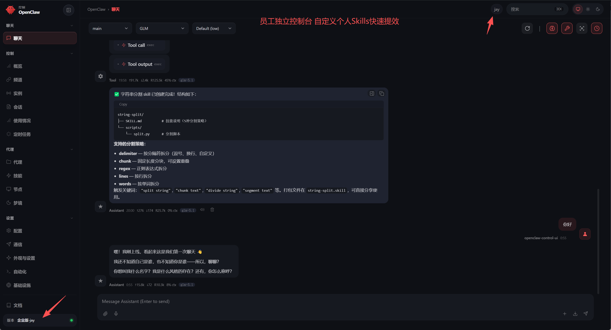

# 🦞 OpenClaw 企业版（本仓库）

    <picture>
        <source media="(prefers-color-scheme: light)" srcset="https://raw.githubusercontent.com/openclaw/openclaw/main/docs/assets/openclaw-logo-text-dark.svg">
        
    </picture>

### 本仓库定位

本仓库在开源 **[OpenClaw](https://github.com/openclaw/openclaw)** 之上做**企业化扩展与打包**：多员工独立网关、集中式管理后台与用量/技能治理，适合「一套底座服务全员、按人隔离数据面」的落地方式。

**如需查看原版 OpenClaw 源码、Issue、Release 与官方文档，请前往：** [github.com/openclaw/openclaw](https://github.com/openclaw/openclaw) · [openclaw.ai](https://openclaw.ai) · [docs.openclaw.ai](https://docs.openclaw.ai)

### 产品亮点

- **一人一网关，业务数据互不串线**：员工维度独立端口与状态目录，会话与用量按人汇总，降低共用单网关时的串线与争用风险。
- **底层能力统一复用，升级一次全员受益**：模型、供应商密钥、公共技能库等共性配置集中维护，迭代与排障不必在十几套环境里重复操作。
- **集约部署，降本增效**：从「多台机器各跑一套、各升一级」收敛为**少量主机扛全队**；员工侧连接即用，运维与硬件成本下来，协作效率上去。
- **管理后台可视化运营**：近 30 天用量与成本总览、网关在线占比、模型与技能监控、员工 Control UI 入口链接一键复制下发，全局态势可读、可管。

### OpenClaw 企业管理后台

企业版附带 **Web 管理后台**（`ui_admin`），用于管理员在浏览器内完成：登录与会话、**数据总览**、**员工管理**（创建/删除、启停网关、Token、复制员工入口深链）、**模型与密钥**、**使用监控**、**技能监控**、以及仓库 `skills/` 下 **公共技能库** 维护。

**管理后台截图：**

|                          登录                          |                                    数据总览                                    |
| :-----------------------------------------------------: | :-----------------------------------------------------------------------------: |
|  |  |

|                                    创建员工                                    |                              员工入口链接（一键复制）                              |
| :-----------------------------------------------------------------------------: | :---------------------------------------------------------------------------------: |
|  |  |

**功能说明：**

- **启动前**：在仓库根目录执行 `pnpm install`；本机需能运行仓库内 `openclaw.mjs`，生产环境建议已构建 `dist/entry.js` 或 `dist/entry.mjs`。
- **访问**：浏览器打开 `http://<服务器IP>:5174/`（以实际部署为准）；默认管理员账号 `admin`，默认密码 `admin1234`（上线后务必改为强密码）。
- **登录与登出**：登录页输入用户名密码，成功后写入 `HttpOnly` 会话 Cookie；登出会清除会话；会话默认约 24 小时有效。
- **左侧导航**：依次为 **数据总览**（近 30 天用量与网关/技能/主模型等汇总）、**员工管理**、**模型管理**、**使用监控**、**技能监控**、**公共技能库**。
- **数据总览**：默认首页；可点「刷新仪表盘」重拉员工、用量、技能、公共技能与主模型；含 KPI 卡片、网关在线占比、按员工 Tokens 与用量走势、模型/供应商 Top；未启动网关的员工在用量或技能上可能显示为空或跳过；接口失败时工具栏会给出错误摘要。
- **员工管理 · 创建**：`username` 3–32 位、小写或数字开头，仅小写字母、数字、`_`、`-`；`port` 在 1024–65535 且不与已有员工冲突（界面建议 `18800–28800`）；可勾选创建后启动网关、以及是否默认沿用主环境的模型与 `auth`、`plugins` 等到员工 `openclaw.json`（不勾选则仅生成最小配置与 Token）。
- **员工管理 · 入口链接**：在「员工入口链接（一键复制）」中配置网关主机、是否 HTTPS/WSS、路径前缀（如 `/openclaw`）、可选页面 URL 模板（支持 `{port}`）；生成含 `gatewayUrl`、`token`、`user` 的 hash 深链，每行可「复制入口链接」发给员工；这些偏好存在浏览器 `localStorage`，换机或清缓存需重配；无 Token 时复制会失败。
- **员工管理 · 运维**：列表可见端口、Token、网关是否运行及 PID；可启动/停止网关（日志在员工目录 `gateway.log`）；可重置 Token（运行中会重启网关，旧 Token 立即作废）；删除员工会停网关并删除其目录与后台记录。
- **员工使用 Control UI**：每人独立端口，无全公司统一的 `18789`；优先用管理员复制的入口链接打开；或让员工在 Control UI 中手动填写 `ws(s)://<可达主机>:<端口>`（含路径前缀若有）与 Token。

  
- **模型管理**：按优先级读写主配置：`OPENCLAW_MAIN_CONFIG_PATH` → `~/.openclaw/openclaw.json` → `OPENCLAW_CONFIG_PATH` → `ui_admin/data/main/openclaw.json`；可编辑主模型（`provider/model`）、Fallback 列表、常见 Provider 的 API Key，保存前有格式校验。
- **使用监控**：按自选天数（如 1–366 天）汇总各员工用量；未运行网关的员工会跳过并提示；含 Token/成本及 Provider、Model、Channel、Agent 等维度。
- **技能监控**：按员工查询技能列表与统计，可填 `agentId`（默认 `main`）；可看可用/禁用/阻断及依赖缺失等；未运行网关同样会跳过提示。
- **公共技能库**：直接维护仓库根目录 `skills/` 下的技能包（列表、新建/删除包、编辑文件并保存写盘）；生效依赖各员工网关与工作区的加载策略。
- **数据落盘（便于备份）**：默认在 `ui_admin/data`；核心含 `store.json`、各 `employees/<id>/openclaw.json`、state 目录与 `gateway.log`；建议定期备份 `store.json` 与 `employees/`。
- **常见排障要点**：登录 401 检查环境变量中的管理员账号密码；提示未构建 UI 时执行 `pnpm ui-admin:build` 或开发态用 `pnpm ui-admin:dev`；开发访问需 API 监听（默认 `38765`）并经 Vite（如 `5174`）走同源代理；网关起不来查端口占用、`openclaw.mjs`/`dist` 与 `gateway.log`；用量/技能失败先确认网关在跑且 Token 有效；复制链接失败核对主机、TLS、前缀、模板与剪贴板权限。

### 开发者联系（微信）

