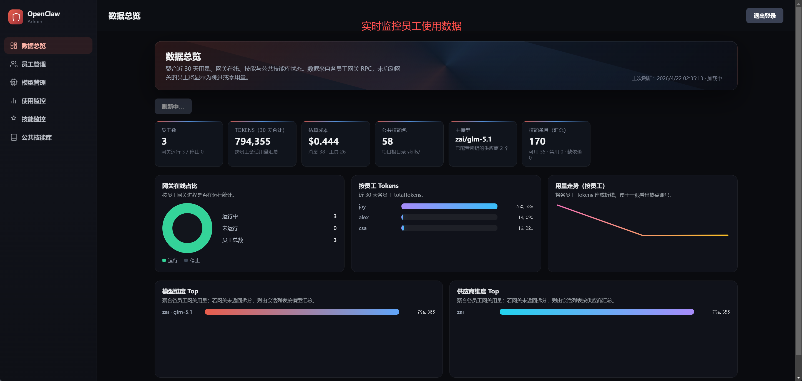
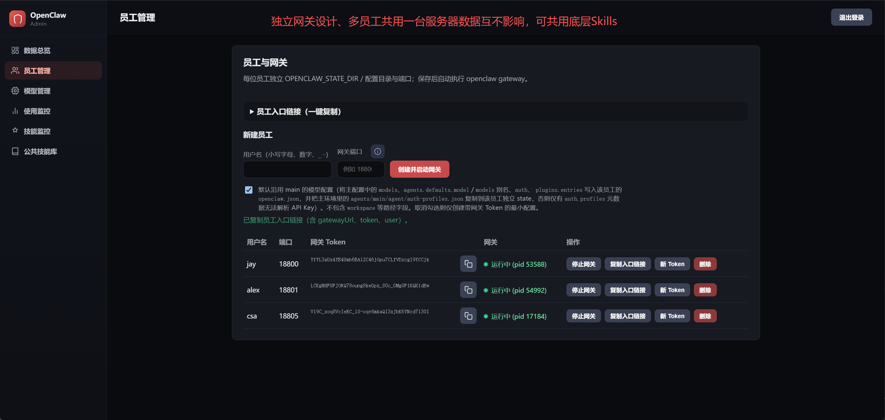
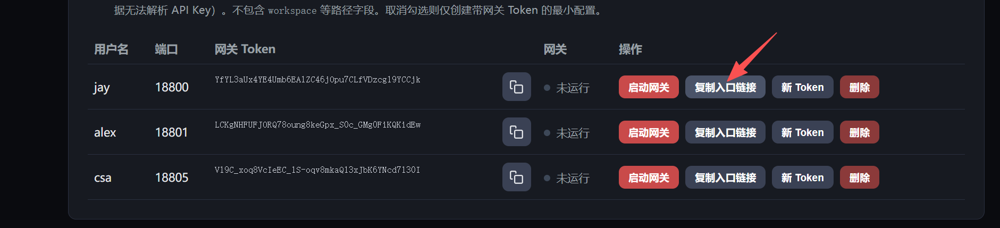
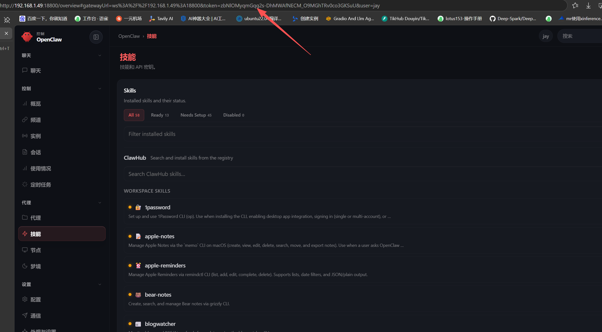
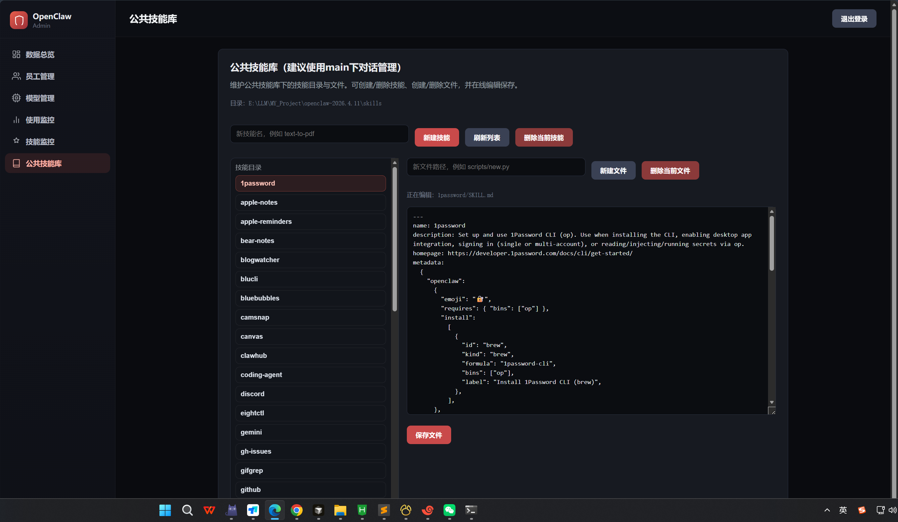

# OpenClaw-企业版管理后台操作使用手册

## 1. 功能概览

OpenClaw 企业版管理后台主要用于：

- 管理后台登录与会话控制
- **数据总览**：近 30 天用量聚合、网关在线占比、按员工/模型/供应商维度的可视化汇总，以及主模型与公共技能库状态速览
- **员工管理**：创建、删除；员工 Gateway 启停；Gateway Token 重置与复制；**一键复制员工 Control UI 入口链接**（含 `gatewayUrl`、`token`、`user` 的 hash 深链）
- **模型管理**：主 Agent 模型、Fallback 列表、常见 Provider 的 API Key 配置
- **使用监控**：按员工采集用量（可自定义天数范围）
- **技能监控**：按员工查询技能状态（可指定 `agentId`）
- **公共技能库**：浏览与编辑仓库根目录 `skills/` 下的公共技能包（创建技能、增删文件、保存内容）

## 2. 启动前准备

推荐先完成以下准备：

- 已在**仓库根目录**执行 `pnpm install`（保证 `ui_admin` 能解析到 Vite 等依赖）
- 能在仓库根目录执行 `pnpm` 命令
- 本机已有可用 `openclaw.mjs`（仓库内默认路径）；生产形态下建议已存在 `dist/entry.js` 或 `dist/entry.mjs`（与 `openclaw.mjs` 引导一致）

## 3. 启动与访问

`http://IP地址:5174/`

默认账号 admin

默认密码 admin1234

## 4. 登录与会话

### 4.1 登录

- 打开后台登录页
- 输入管理员用户名/密码
- 登录成功后会写入 `HttpOnly` 会话 Cookie
  

### 4.2 登出

- 点击登出后会清理当前会话 Cookie
- 会话默认有效期为 24 小时

## 5. 主导航说明

登录后左侧主导航与页面标题一致，依次为：

| 导航名称             | 说明                                                                     |
| -------------------- | ------------------------------------------------------------------------ |
| **数据总览**   | 仪表盘：固定统计近**30** 天用量并汇总网关/技能/公共技能/主模型信息 |
| **员工管理**   | 创建员工、启停网关、Token、**复制入口链接**                        |
| **模型管理**   | 编辑主配置中的主模型与 Provider 密钥等                                   |
| **使用监控**   | 按自选天数拉取各员工用量明细                                             |
| **技能监控**   | 按员工与 `agentId` 查看技能列表与统计                                  |
| **公共技能库** | 管理仓库 `skills/` 下公共技能文件                                      |

## 6. 数据总览（Dashboard）

**数据总览**为登录后的默认首页，数据来自各员工网关 RPC 与主配置接口；未启动网关的员工在用量/技能侧可能显示为跳过或零数据。

页面主要包含：

- **刷新仪表盘**：手动重新拉取员工列表、用量、技能、公共技能列表与主模型信息
- **KPI 卡片**：员工数及网关运行/停止数；近 30 天 **Tokens 合计**与**估算成本**；消息数与工具调用数汇总；`skills/` 下公共技能包数量；当前**主模型**（`provider/model`）及已配置密钥的供应商数量；各员工技能条目的汇总（总数、可用、禁用、缺依赖等）
- **网关在线占比**：环形图与运行/未运行人数
- **按员工 Tokens**：横向条形对比（近 30 天各员工 `totalTokens`）
- **用量走势（按员工）**：将各员工 Tokens 连成折线，便于发现热点账号
- **模型维度 Top / 供应商维度 Top**：聚合各员工用量后的 Top 条形图

若某一类接口失败，工具栏区域会显示对应错误摘要（用量、技能、公共技能、模型等）。

## 7. 员工管理

### 7.1 创建员工

创建时需要填写：

- `username`：3-32 位，小写字母/数字开头，仅允许小写字母、数字、`_`、`-`
- `port`：`1024-65535` 且不能与现有员工冲突（界面提示建议 **`18800–28800`** 区间，便于与常见默认端口错开）
- **创建并启动网关**：提交后默认启动该员工 Gateway
- **默认沿用 main 的模型配置**（勾选，默认开启）：将主配置中的 `models`、`agents.defaults.model` / `models` 别名、`auth`、`plugins.entries` 写入员工 `openclaw.json`，并把主环境中的 `agents/main/agent/auth-profiles.json` 复制到该员工独立 state；**取消勾选**则仅创建带网关 Token 的最小配置

创建成功后系统会自动：

- 生成员工唯一 `id`
- 生成 `gatewayToken`
- 创建员工目录与状态目录
- 写入员工 `openclaw.json`
- 按选项启动该员工 Gateway

  

### 7.2 员工入口链接（一键复制）

在 **员工管理** 页顶部可展开 **「员工入口链接（一键复制）」**，用于配置生成发给员工的 **Control UI 深链**（页面地址 + hash 参数）。表格每行有 **「复制入口链接」** 按钮。

链接规则（与界面说明一致）：

- Hash 内携带 `gatewayUrl`、`token`、`user`，便于员工浏览器打开后直接预填连接信息；参数在 hash 中可降低进入 HTTP 访问日志的风险
- **默认页面地址**（未填写「页面 URL 模板」时）：`http://` 或 `https://` + **网关主机** + `:` + **员工端口** + **路径前缀** + `/overview` + `#...`
- **gatewayUrl**（WebSocket 地址）：`ws://` 或 `wss://` + **WebSocket 主机**（默认同网关主机）+ `:` + **员工端口** + **路径前缀**
- **路径前缀**：与网关 Control UI / WS 的 `basePath` 一致（例如 `/openclaw`），需以 `/` 开头，留空表示根路径
- **页面 URL 模板**（可选）：覆盖默认的 `http(s)://主机:端口/.../overview`。可包含占位符 **`{port}`**，会替换为当前员工端口；若模板**不含** `{port}`，表示所有员工共用同一页面入口，此时务必正确填写 **WebSocket 主机**，使员工浏览器能连到对应网关
- **使用 HTTPS / WSS**：勾选后页面与 `gatewayUrl` 分别使用 `https` / `wss`（适用于反代、Tailscale Serve 等）

上述偏好（网关主机、TLS、前缀、模板、WS 主机）保存在**当前浏览器**的 `localStorage`，换电脑或清缓存需重新配置。

若员工尚未配置 Token，复制链接会失败并提示。

### 7.3 查看员工列表

员工列表可看到：

- 用户名、端口
- 网关 Token（可复制）
- Gateway 是否运行及进程 PID（运行时）

### 7.4 启停员工 Gateway

- **启动网关** / **停止网关**：对指定员工执行启停

说明：

- Gateway 以子进程运行，日志写入员工目录下 `gateway.log`
- 每次启动会在日志中记录启动时间与端口

### 7.5 重置 Gateway Token

表格中 **「新 Token」** 会：

- 生成新的随机 Token
- 更新员工配置文件
- 若该员工 Gateway 正在运行，则自动重启使 Token 生效

重置后页面可能出现 **「网关 Token（请立即复制保存）」** 横幅，请尽快复制；旧 Token 立即失效。

### 7.6 删除员工

删除会执行以下操作：

- 停止员工 Gateway（如在运行）
- 删除员工目录数据
- 从后台存储中移除该员工记录

### 7.7 员工侧如何使用（Control UI）

方式一 、直接浏览器访问管理员后台分发的一键登录地址

方式二、手动填入端口和token

每位员工对应 **独立网关端口**（创建时指定），**没有**统一固定的 `18789` 或 `localhost` 端口。管理员应：

1. 使用 **「复制入口链接」** 将完整 URL 发给员工；或
2. 让员工在 Control UI 中手动填写 **Gateway URL**（形如 `ws://<可达主机>:<员工端口>`，若部署了路径前缀需一并包含）与 **Token**（与后台显示一致）、必要时填写展示名（`user` 对应用户名）。

员工在浏览器中打开链接或完成连接后即可使用 Control UI。界面示例（以实际部署地址为准）：

## 8. 主模型管理

后台支持查看与更新主配置中的模型信息，配置文件路径解析优先级如下：

1. `OPENCLAW_MAIN_CONFIG_PATH`
2. `~/.openclaw/openclaw.json`（若存在）
3. `OPENCLAW_CONFIG_PATH`
4. `ui_admin/data/main/openclaw.json`

可管理项包括：

- 主 Agent 模型（`provider/model` 格式）
- Fallback 模型列表
- 常见 Provider 的 API Key

保存时会进行格式校验，例如模型引用必须满足 `provider/model` 形式。

## 9. 使用监控

对应界面 **「使用监控」**。可按员工采集并汇总使用情况：

- 支持按天数范围查询（1-366 天）
- 对未运行 Gateway 的员工会跳过并提示
- 包含 Token/Cost 聚合、Provider/Model/Channel/Agent 维度统计

若员工未配置 Token 或调用失败，会显示对应错误信息，便于排查。

## 10. 技能监控

对应界面 **「技能监控」**。可按员工查询技能状态：

- 支持传入 `agentId`（默认 `main`）
- 返回技能总数、可用数、禁用数、被 allowlist 阻断数
- 可查看每个技能的来源、是否 bundled、缺失依赖数量等

同样会对未运行 Gateway 员工做跳过提示。

## 11. 公共技能库

对应界面 **「公共技能库」**，数据来源为仓库根目录下的 **`skills/`**（与服务器 `PUBLIC_SKILLS_ROOT` 一致）。

常见操作：

- 浏览技能列表及每个技能包内文件
- 新建技能包、删除整个技能目录
- 选择文件后查看与编辑内容，**保存**写回磁盘
- 在选中技能下新建文件路径（如 `scripts/foo.py`）并编辑

适合在管理后台快速维护团队共享的公共技能文档与脚本入口；修改后依赖各员工网关/工作区实际加载策略生效。

## 12. 数据与目录说明

默认数据目录：`ui_admin/data`

核心文件与目录：

- `store.json`：员工清单与基础元数据
- `employees/<employeeId>/openclaw.json`：员工网关配置
- `employees/<employeeId>/state/`：员工状态目录
- `employees/<employeeId>/gateway.log`：员工网关日志

建议对 `store.json` 与 `employees/` 做定期备份。

## 13. 常见问题排查

### 13.1 登录失败（401）

- 检查 `OPENCLAW_ADMIN_USER` / `OPENCLAW_ADMIN_PASSWORD`
- 注意用户名密码区分大小写

### 13.2 页面提示未构建 UI

- 说明 `dist/ui-admin` 不存在
- 执行 `pnpm ui-admin:build` 后仅用 `pnpm ui-admin:server` 访问；开发阶段可用 `pnpm ui-admin:dev` 无需先 build

### 13.3 开发模式打不开或 API 异常

- 确认 API 进程已监听（默认 `38765`）
- 通过 Vite 地址（默认 `5174`）访问以保证 `/api` 代理同源
- 若本机防火墙拦截，放行对应端口

### 13.4 员工 Gateway 启动失败

优先检查：

- 端口是否已被占用
- 仓库中 `openclaw.mjs` 是否存在，且 `dist` 入口是否满足当前引导要求
- 员工目录下 `gateway.log` 的最新报错

### 13.5 用量/技能采集失败

- 确认员工 Gateway 在运行
- 确认该员工已配置有效 `gatewayToken`
- 查看员工 `gateway.log` 与后台服务日志

### 13.6 复制入口链接失败

- 确认该员工已显示网关 Token
- 检查浏览器是否允许写入剪贴板
- 检查「员工入口链接」中主机、TLS、路径前缀、页面模板是否与真实部署一致

## 14. 运营建议

- 禁用默认管理员密码，最少使用强随机密码
- 后台服务尽量只监听回环或内网地址；开发用的 `0.0.0.0` 绑定勿直接暴露公网
- 定期轮换员工 Gateway Token
- 对员工配置与日志做分级访问控制
- 向员工分发连接信息时优先使用 **复制入口链接**，减少手工填错端口或协议的情况
