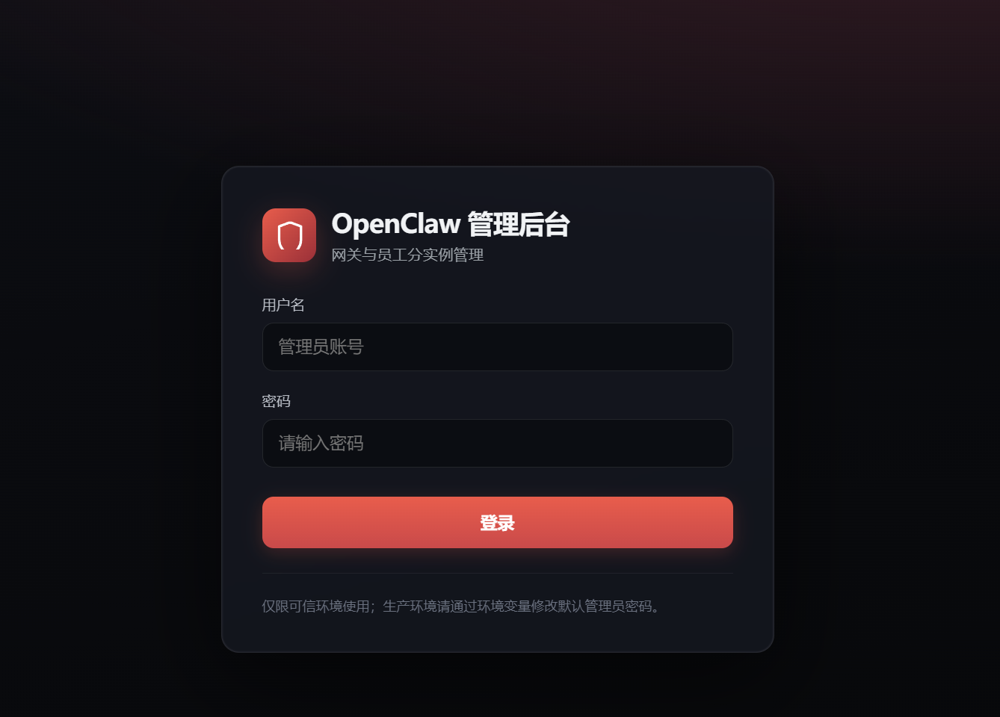
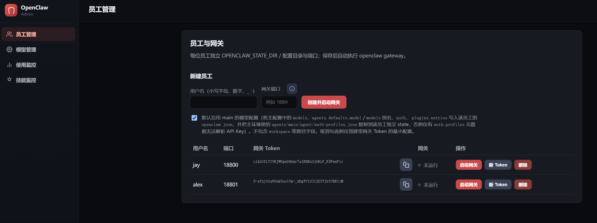
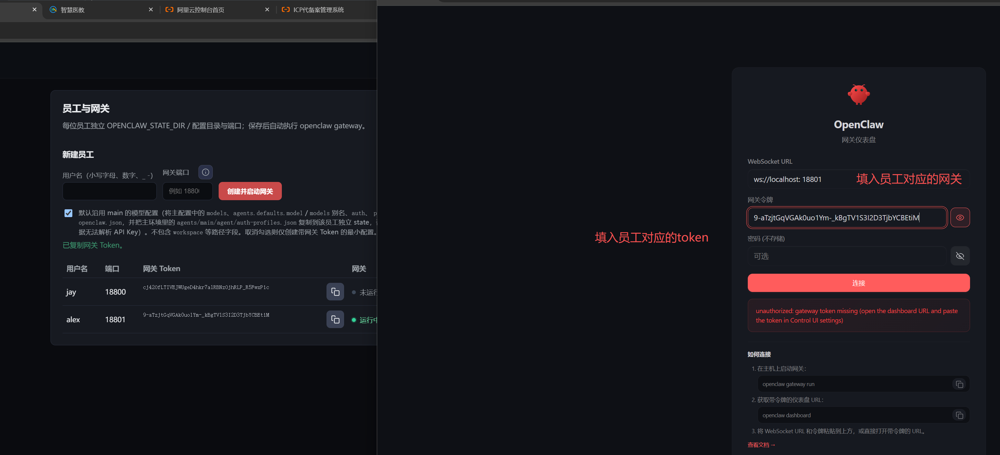
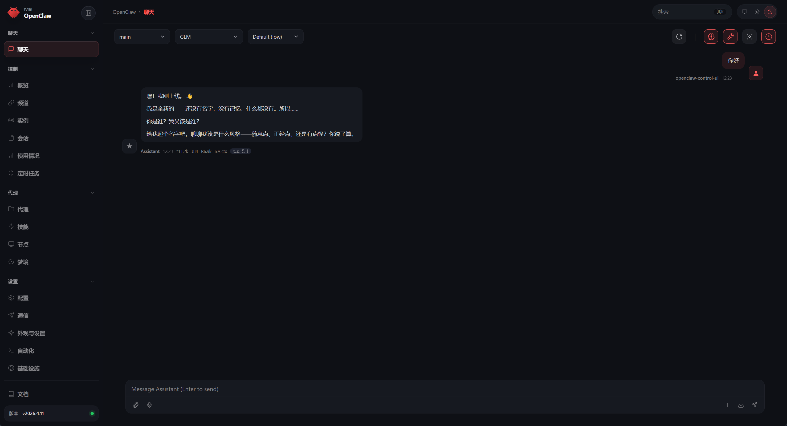
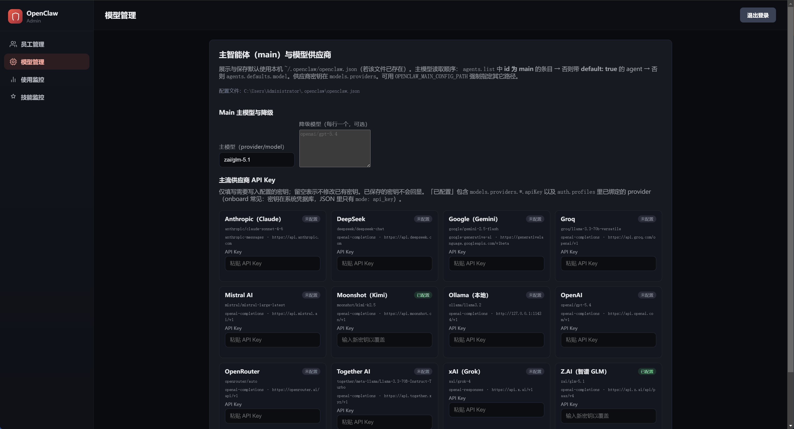
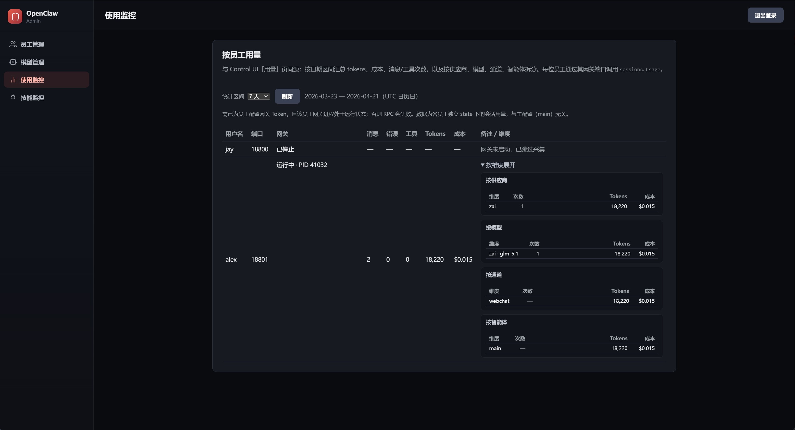
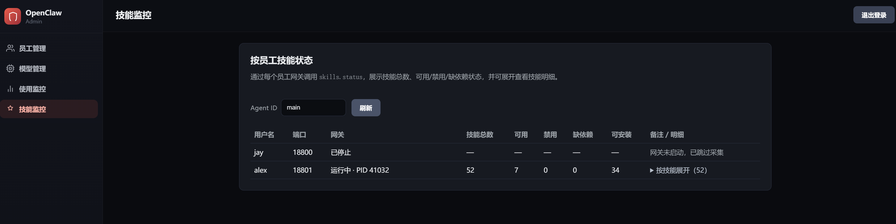

# OpenClaw-企业版管理后台操作使用手册

## 1. 功能概览

 openClaw-企业版管理后台主要用于：

- 管理后台登录与会话控制
- 员工账号管理（创建、删除）
- 员工 Gateway 进程启停
- 员工 Gateway Token 重置
- 主模型与 Provider API Key 配置
- 员工维度用量统计（Usage）
- 员工维度技能状态统计（Skills）

## 2. 启动前准备

推荐先完成以下准备：

- 已安装项目依赖（根目录与 `ui_admin` 目录）
- 能在仓库根目录执行 `pnpm` 命令
- 本机已有可用 `openclaw.mjs`（仓库内默认路径）
- 明确后台监听地址与端口（默认 `127.0.0.1:38765`）

可用环境变量：

- `OPENCLAW_ADMIN_USER`：后台登录用户名，默认 `admin`
- `OPENCLAW_ADMIN_PASSWORD`：后台登录密码，默认 `admin1234`
- `OPENCLAW_ADMIN_SERVER_PORT`：后台端口，默认 `38765`
- `OPENCLAW_ADMIN_BIND`：后台监听地址，默认 `127.0.0.1`
- `OPENCLAW_ADMIN_DATA_DIR`：后台数据目录，默认 `ui_admin/data`
- `OPENCLAW_MAIN_CONFIG_PATH`：主配置文件路径（优先级最高）
- `OPENCLAW_MAIN_STATE_DIR`：主状态目录（用于复制主账号 auth profiles）

## 3. 启动与访问

在仓库根目录启动后台服务：

```bash
pnpm ui-admin:server
```

启动后访问：

- `http://127.0.0.1:38765`

如果前端静态资源未构建，页面会提示：

- `Admin UI not built. Run: pnpm ui-admin:build`

这时按提示构建 `ui_admin` 前端后再刷新页面。

## 4. 登录与会话

### 4.1 登录

- 打开后台登录页
- 输入管理员用户名/密码
- 登录成功后会写入 `HttpOnly` 会话 Cookie
  

### 4.2 登出

- 点击登出后会清理当前会话 Cookie
- 会话默认有效期为 24 小时

### 4.3 安全建议

- 生产环境务必覆盖默认账号密码
- 建议仅绑定内网地址并通过受控入口访问
- 建议将 `OPENCLAW_ADMIN_DATA_DIR` 放在受控目录并定期备份

## 5. 员工管理

## 5.1 创建员工

创建时需要填写：

- `username`：3-32 位，小写字母/数字开头，仅允许小写字母、数字、`_`、`-`
- `port`：`1024-65535` 且不能与现有员工冲突
- 是否立即启动 Gateway（默认启动）
- 是否继承主模型配置（默认继承）

创建成功后系统会自动：

- 生成员工唯一 `id`
- 生成 `gatewayToken`
- 创建员工目录与状态目录
- 写入员工 `openclaw.json`
- 按选项启动该员工 Gateway

  

## 5.2 查看员工列表

员工列表可看到：

- 用户名、端口、创建时间
- Gateway 是否运行
- Gateway 进程 PID（运行时）
- 当前 Gateway Token（如已配置）

## 5.3 启停员工 Gateway

- 启动：对指定员工执行启动
- 停止：对指定员工执行停止

说明：

- Gateway 以子进程运行，日志写入员工目录下 `gateway.log`
- 每次启动会在日志中记录启动时间与端口

## 5.4 重置 Gateway Token

重置后系统会：

- 生成新的随机 Token
- 更新员工配置文件
- 若该员工 Gateway 正在运行，则自动重启使 Token 生效

## 5.5 删除员工

删除会执行以下操作：

- 停止员工 Gateway（如在运行）
- 删除员工目录数据
- 从后台存储中移除该员工记录

## 5.6 员工使用

员工登录http://localhost:18789/
在登录界面填入自己的网关和专属token



登录后使用



## 6. 主模型管理

后台支持查看与更新主配置中的模型信息，配置文件路径解析优先级如下：

1. `OPENCLAW_MAIN_CONFIG_PATH`
2. `~/.openclaw/openclaw.json`（若存在）
3. `OPENCLAW_CONFIG_PATH`
4. `ui_admin/data/main/openclaw.json`

可管理项包括：

- 主 Agent 模型（`provider/model` 格式）
- Fallback 模型列表
- 常见 Provider 的 API Key

保存时会进行格式校验，例如模型引用必须满足 `provider/model` 形式。



## 7. 用量统计（Usage）

后台可按员工采集并汇总使用情况：

- 支持按天数范围查询（1-366 天）
- 对未运行 Gateway 的员工会跳过并提示
- 包含 Token/Cost 聚合、Provider/Model/Channel/Agent 维度统计

若员工未配置 Token 或调用失败，会显示对应错误信息，便于排查。



## 8. 技能统计（Skills）

后台可按员工查询技能状态：

- 支持传入 `agentId`（默认 `main`）
- 返回技能总数、可用数、禁用数、被 allowlist 阻断数
- 可查看每个技能的来源、是否 bundled、缺失依赖数量等

同样会对未运行 Gateway 员工做跳过提示。





## 9. 数据与目录说明

默认数据目录：`ui_admin/data`

核心文件与目录：

- `store.json`：员工清单与基础元数据
- `employees/<employeeId>/openclaw.json`：员工网关配置
- `employees/<employeeId>/state/`：员工状态目录
- `employees/<employeeId>/gateway.log`：员工网关日志

建议对 `store.json` 与 `employees/` 做定期备份。

## 10. 常见问题排查

### 10.1 登录失败（401）

- 检查 `OPENCLAW_ADMIN_USER` / `OPENCLAW_ADMIN_PASSWORD`
- 注意用户名密码区分大小写

### 10.2 页面提示未构建 UI

- 说明 `dist/ui-admin` 不存在
- 构建 `ui_admin` 前端后重新访问

### 10.3 员工 Gateway 启动失败

优先检查：

- 端口是否已被占用
- 仓库中 `openclaw.mjs` 是否存在
- 员工目录下 `gateway.log` 的最新报错

### 10.4 用量/技能采集失败

- 确认员工 Gateway 在运行
- 确认该员工已配置有效 `gatewayToken`
- 查看员工 `gateway.log` 与后台服务日志

## 11. 运营建议

- 禁用默认管理员密码，最少使用强随机密码
- 后台服务尽量只监听回环或内网地址
- 定期轮换员工 Gateway Token
- 对员工配置与日志做分级访问控制
